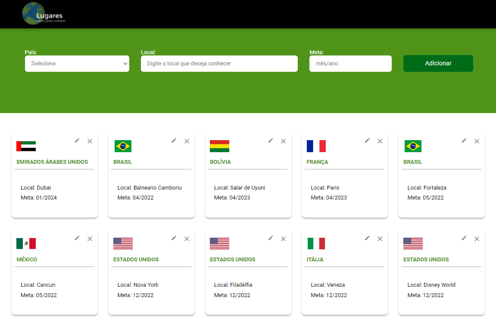

<h1 align="center">
    
</h1>

<p align="center">
  <a href="#-tecnologias">Tecnologias</a>&nbsp;&nbsp;&nbsp;|&nbsp;&nbsp;&nbsp;
  <a href="#-projeto">Projeto</a>&nbsp;&nbsp;&nbsp;|&nbsp;&nbsp;&nbsp;
  <a href="#-layout">Layout</a>&nbsp;&nbsp;&nbsp;|&nbsp;&nbsp;&nbsp;
  <a href="#pré-requisitos">Pré-Requisitos</a>&nbsp;&nbsp;&nbsp;|&nbsp;&nbsp;&nbsp;
  <a href="#-rodando-nossa-aplicação">Como Executar</a>&nbsp;&nbsp;&nbsp;|&nbsp;&nbsp;&nbsp;
  <a href="#-google-cloud-platform">Deploy</a>
</p>

<br>

<p align="center">
  
</p>

## 🚀 Tecnologias

Esse projeto foi desenvolvido com as seguintes tecnologias:

- [NestJS](https://nestjs.com/)
- [TypeORM](https://typeorm.io/#/)
- [MongoDB](https://www.mongodb.com/)
- [React](https://reactjs.org)
- [TypeScript](https://www.typescriptlang.org/)

## 💻 Projeto

O Lugares que quero conhecer é uma aplicação que cadastra os lugares que quero conhecer.

## 🔖 Layout

No link abaixo você encontra o layout do projeto web. Lembrando que você precisa ter uma conta no [Figma](http://figma.com/) para acessá-lo.

- [Layout Web](https://www.figma.com/file/IC0xt3K3X21rLEfLRQ3mpl/Lugares-que-quero-conhecer)

## Pré-requisitos

Antes de começar, você vai precisar ter instalado em sua máquina as seguintes ferramentas:
 - [Git](https://git-scm.com)
 - [Node.js](https://nodejs.org/en/)
 - [NestJS](https://nestjs.com/)
 - [MongoDB](https://www.mongodb.com/try/download/community) 
 - [React Native](https://reactnative.dev/).

## 🎲 Rodando nossa aplicação


# Clone este repositório
```bash
$ git clone git@github.com:williandf/clubpetro-challenge.git

# Acesse a pasta do projeto no terminal/cmd
$ cd clubpetro-challenge
```

## Rodando o Back End da Apliação
```bash
# Acesse a pasta do back-end no terminal/cmd
$ cd backend

# Instale as dependências
$ npm install
$ yarn add

# Execute a aplicação em modo de desenvolvimento
$ npm run start
$ yarn start

# Caso prefira execute a aplicação em watch mode
$ npm run start:dev
$ yarn start:dev
```

## Rodando o FrontEnd da Apliação
```bash
# Acesse a pasta do back-end no terminal/cmd
$ cd web

# Instale as dependências
$ npm install
$ yarn add

# Execute a aplicação em modo de desenvolvimento
$ npm run start
$ yarn start
```

## Google Cloud Platform

Acesso ao app em produção clicando [aqui](https://frontend-clubpetrp.rj.r.appspot.com/)